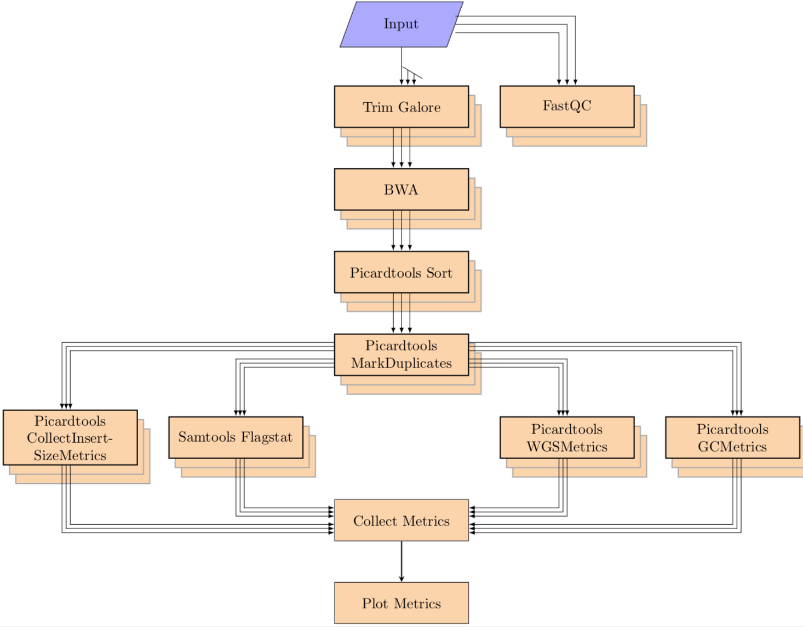
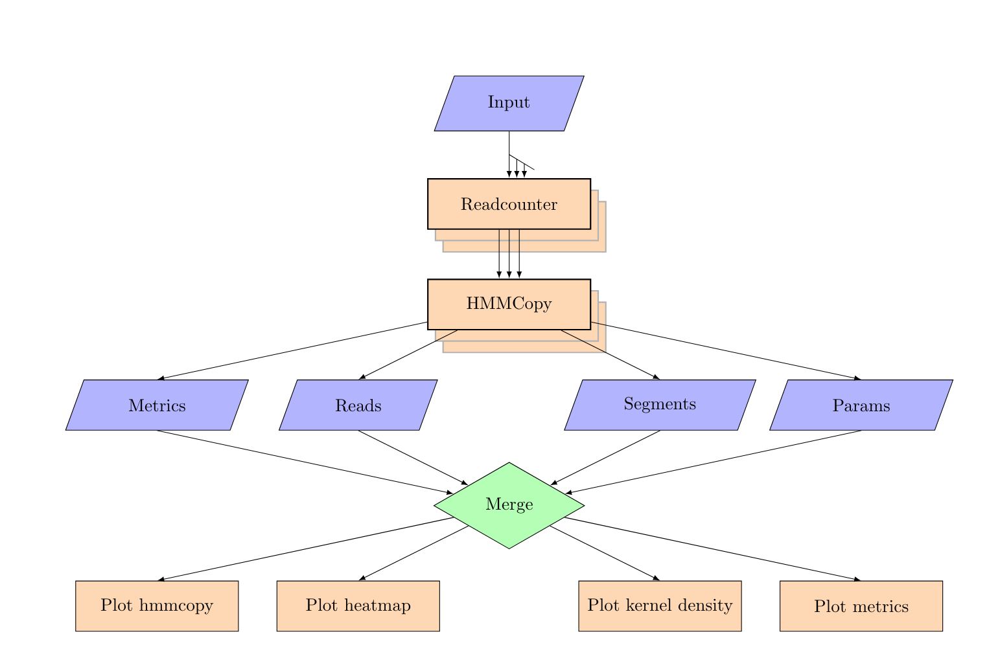
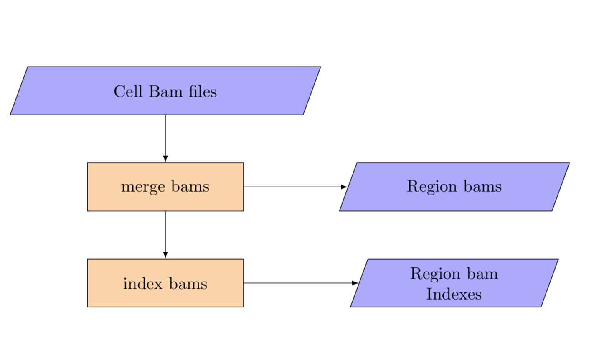
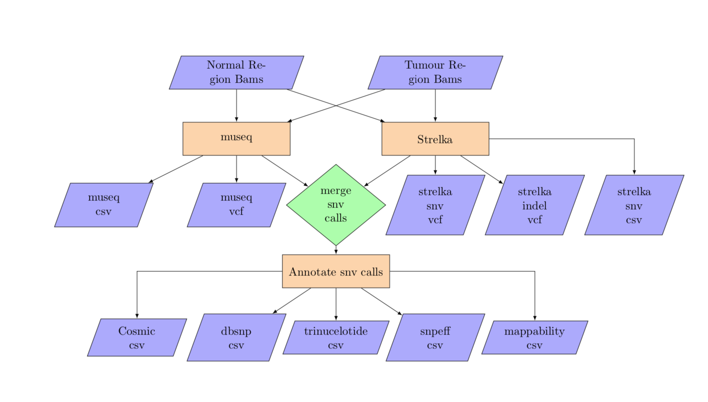

# Single Cell Pipeline 

For a detailed guide see [INSTALL](docs/INSTALL)

For azure documentation see [azure](docs/azure)

For LSF + singularity documentation see [Singularity](docs/singularity/singularity.md)

[Changelog](CHANGELOG.md)


## 1. Alignment



The single cell analysis pipeline runs on a list of pairs of fastq file (paired end) and performs the following steps:

Alignment:

1. Run fastqc on the fastq files
2. Align the fastq pairs with bwa (supports both mem and aln)
3. Merge all lanes together
4. create targets and realign around those targets with GATK
5. sort bams files, mark duplicate reads and index final bams
6. collect metrics from samtools flagstat, picardtools CollectInsertSizeMetrics, picardtools CollectWgsMetrics and picardtools CollectGcBiasMetrics
7. generate QC plot

### Input
The pipeline accepts a yaml file as input. The yaml file contains the input paths and metadata for each cell, the format for each cell is as follows:
```
SA12345-A12345-R01-C01:
  column: 01 # column number of the well on chip
  condition: A # condition during experiment. will be renamed to experimental_condition in output
  fastqs:
    LANE_ID_1:
      fastq_1: /path/to/fastqfile/ACTACT-AGTAGT_1.fastq.gz
      fastq_2: /path/to/fastqfile/ACTACT-AGTAGT_1.fastq.gz
      sequencing_center: CENTERID # sequencing center id
      sequencing_instrument: INSTRUMENT_TYPE # sequencing machine (HiseqX for hiseq, N550 for nextseq machine). pipeline will not run trim galore on N550 output.
    LANE_ID_2:
      fastq_1: /path/to/fastqfile/ATTATT-ACTACT_1.fastq.gz
      fastq_2: /path/to/fastqfile/ATTATT-ACTACT_1.fastq.gz
      sequencing_center: CENTERID
      sequencing_instrument: INSTRUMENT_TYPE
  img_col: 10 # column number of the well on chip image
  index_i5: i5-INDEX
  index_i7: i7-INDEX
  pick_met: CELLCALL # describes whether cell is dividing, dead etc. will be renamed in output to cell_call
  primer_i5: ACTACTATT
  primer_i7: AGTAGTACT
  row: 01 # row number of the well on chip
  sample_type: C # sample type (flagged by wet lab team)
```

### Run:

```
single_cell alignment \
--input_yaml inputs/SC-1234/fastqs.yaml \
--tmpdir temp/SC-1234/tmp \
--pipelinedir pipeline/SC-1234  \
--out_dir results/SC-1234/results/alignment \
--bams_dir results/SC-1234/results/bams \
 --library_id A123123 \
 ...
```


## 2. HMMcopy



Hmmcopy:

1. generate read count wig files from the bam files
2. perform  GC correction
3. Run Hmmcopy to predict copynumber states
4. generate segment and bias plots, kernel density plot and heatmaps 


### Input
The pipeline accepts a yaml file as input. The yaml file contains the input paths and metadata for each cell, the format for each cell is as follows:
```
SA12345-A12345-R01-C01:
  bam: /path/to/aligned/SA12345-A12345-R01-C01.bam # path to the bam file, align mode will write a bam file to this path
  column: 01 # column number of the well on chip
  condition: A # condition during experiment. will be renamed to experimental_condition in output
  img_col: 10 # column number of the well on chip image
  index_i5: i5-INDEX
  index_i7: i7-INDEX
  pick_met: CELLCALL # describes whether cell is dividing, dead etc. will be renamed in output to cell_call
  primer_i5: ACTACTATT
  primer_i7: AGTAGTACT
  row: 01 # row number of the well on chip
  sample_type: C # sample type (flagged by wet lab team)
```

### Run:

```
single_cell hmmcopy \
--input_yaml inputs/SC-1234/bams.yaml \
--tmpdir temp/SC-1234/tmp \
--pipelinedir pipeline/SC-1234  \
--out_dir results/SC-1234/results/hmmcopy \
 --library_id A123123 \
 ...
```


## 3. Annotation


Annotation:
1. Assign a quality score to each cell
2. Assign cell state to each cell
3. Generate a consolidated table with all metrics frim hmmcopy, alignment and from annotation

### Input
The pipeline accepts a yaml file as input. The yaml file contains the input paths and metadata for each cell, the format for each cell is as follows:

```
hmmcopy_metrics: results/hmmcopy/A12345A_hmmcopy_metrics.csv.gz
hmmcopy_reads: results/hmmcopy/A12345_reads.csv.gz
alignment_metrics: results/alignment/A12345_alignment_metrics.csv.gz
gc_metrics: results/alignment/A12345_gc_metrics.csv.gz
segs_pdf_tar: results/hmmcopy/A12345_segs.tar.gz```
```

### Run 

```
single_cell annotation \
--input_yaml inputs/SC-1234/annotation.yaml \
--tmpdir temp/SC-1234/tmp \
--pipelinedir pipeline/SC-1234  \
--out_dir results/SC-1234/results/annotation \
 --library_id A123123 \
 ...
```


## 4. merge cell bams



The tumour needs to be simultaneously merged across cells and split by region. The input for this step is the per cell bam yaml and the template for the merged bams by region.

### Input:
```
cell_bams:
    SA123X5-A12345-R04-C03:
      bam: data/single_cell_indexing/bam/A12345/grch37/bwa-aln/SA123X5-A12345-R04-C03.bam
    SA123X5-A12345-R04-C05:
      bam: data/single_cell_indexing/bam/A12345/grch37/bwa-aln/SA123X5-A12345-R04-C05.bam
    SA123X5-A12345-R04-C07:
      bam: data/single_cell_indexing/bam/A12345/grch37/bwa-aln/SA123X5-A12345-R04-C07.bam
    SA123X5-A12345-R04-C09:
      bam: data/single_cell_indexing/bam/A12345/grch37/bwa-aln/SA123X5-A12345-R04-C09.bam
    SA123X5-A12345-R04-C10:
      bam: data/single_cell_indexing/bam/A12345/grch37/bwa-aln/SA123X5-A12345-R04-C10.bam
```

### Run:
```
single_cell merge_cell_bams \
--input_yaml inputs/SC-1234/merge_cell_bams.yaml \
--tmpdir temp/SC-1234/tmp \
--pipelinedir pipeline/SC-1234  \
--out_dir results/SC-1234/results \
 ...
```


## 5. split bams


The normal also needs to be split by region from an input data path to an output per region template.

### Input:
```
normal:
  bam: scdnadev/testdata/pseudobulk/DAH370N_filtered.bam
```

###Run:
```
single_cell split_wgs_bam \
 --input_yaml inputs/SC-1234/merge_cell_bams.yaml \
--tmpdir temp/SC-1234/tmp \
--pipelinedir pipeline/SC-1234  \
--out_dir results/SC-1234/results \
...
```


## 6. Variant Calling



Inputs are a WGS tumour bam file and a WGS normal bam file along with the tumour cells. The bam files are used for the variant calling. The pipeline also generates counts at the snvs for each cell.
The variant calling takes in both the per cell bam yaml, using the per cell bams for variant allele counting, and the tumour and normal region templates for calling snvs in parallel by region.


### Input:
```
normal:
  1-1-10000000:
    bam: split_wgs_bam/1-1-10000000_split_wgs.bam
  1-100000001-110000000:
    bam: split_wgs_bam/1-100000001-110000000_split_wgs.bam
  1-10000001-20000000:
    bam: split_wgs_bam/1-10000001-20000000_split_wgs.bam
  ...
tumour:
  1-1-10000000:
    bam: merge_cell_bams/1-1-10000000_split_wgs.bam
  1-100000001-110000000:
    bam: merge_cell_bams/1-100000001-110000000_split_wgs.bam
  1-10000001-20000000:
    bam: merge_cell_bams/1-10000001-20000000_split_wgs.bam
  ...
```


###Run:
```
single_cell variant_calling \
 --input_yaml inputs/SC-1234/variant_calling.yaml \
--tmpdir temp/SC-1234/tmp \
--pipelinedir pipeline/SC-1234  \
--out_dir results/SC-1234/results \
...
```


## 7. Breakpoint calling


The breakpoint analysis takes in per cell bam yaml in addition to the unsplit matched normal bam filename.

### Input:
 
#### yaml file format with a single normal bam
```
normal_wgs:
    bam: singlecelldatatest/testdata/pseudobulk/SA123N.bam
tumour_cells:
    SA123X5-A12345-R04-C03:
      bam: data/single_cell_indexing/bam/A12345/grch37/bwa-aln/SA123X5-A12345-R04-C03.bam
    SA123X5-A12345-R04-C05:
      bam: data/single_cell_indexing/bam/A12345/grch37/bwa-aln/SA123X5-A12345-R04-C05.bam
    SA123X5-A12345-R04-C07:
      bam: data/single_cell_indexing/bam/A12345/grch37/bwa-aln/SA123X5-A12345-R04-C07.bam
    SA123X5-A12345-R04-C09:
      bam: data/single_cell_indexing/bam/A12345/grch37/bwa-aln/SA123X5-A12345-R04-C09.bam
    SA123X5-A12345-R04-C10:
      bam: data/single_cell_indexing/bam/A12345/grch37/bwa-aln/SA123X5-A12345-R04-C10.bam
```

#### yaml file format with a cells for normal
```
normal_cells:
    SA123N-A12345-R04-C03:
      bam: data/single_cell_indexing/bam/A12345/grch37/bwa-aln/SA123X5-A12345-R04-C03.bam
    SA123N-A12345-R04-C05:
      bam: data/single_cell_indexing/bam/A12345/grch37/bwa-aln/SA123X5-A12345-R04-C05.bam
    SA123N-A12345-R04-C07:
      bam: data/single_cell_indexing/bam/A12345/grch37/bwa-aln/SA123X5-A12345-R04-C07.bam
    SA123N-A12345-R04-C09:
      bam: data/single_cell_indexing/bam/A12345/grch37/bwa-aln/SA123X5-A12345-R04-C09.bam
    SA123N-A12345-R04-C10:
      bam: data/single_cell_indexing/bam/A12345/grch37/bwa-aln/SA123X5-A12345-R04-C10.bam
tumour_cells:
    SA123X5-A12345-R04-C03:
      bam: data/single_cell_indexing/bam/A12345/grch37/bwa-aln/SA123X5-A12345-R04-C03.bam
    SA123X5-A12345-R04-C05:
      bam: data/single_cell_indexing/bam/A12345/grch37/bwa-aln/SA123X5-A12345-R04-C05.bam
    SA123X5-A12345-R04-C07:
      bam: data/single_cell_indexing/bam/A12345/grch37/bwa-aln/SA123X5-A12345-R04-C07.bam
    SA123X5-A12345-R04-C09:
      bam: data/single_cell_indexing/bam/A12345/grch37/bwa-aln/SA123X5-A12345-R04-C09.bam
    SA123X5-A12345-R04-C10:
      bam: data/single_cell_indexing/bam/A12345/grch37/bwa-aln/SA123X5-A12345-R04-C10.bam
```

### Run:

```
single_cell breakpoint_calling \
 --input_yaml inputs/SC-1234/breakpoint_calling.yaml \
--tmpdir temp/SC-1234/tmp \
--pipelinedir pipeline/SC-1234  \
--out_dir results/SC-1234/results \
...
```

NOTE: The input bam files for lumpy must be aligned with bwa mem. 


## 8. Haplotype calling:


The haplotype analysis takes in per cell bam yaml in addition to the unsplit matched normal bam filename.

### Input:
 
#### yaml file format with a single normal bam
```
normal_wgs:
    bam: singlecelldatatest/testdata/pseudobulk/SA123N.bam
tumour_cells:
    SA123X5-A12345-R04-C03:
      bam: data/single_cell_indexing/bam/A12345/grch37/bwa-aln/SA123X5-A12345-R04-C03.bam
    SA123X5-A12345-R04-C05:
      bam: data/single_cell_indexing/bam/A12345/grch37/bwa-aln/SA123X5-A12345-R04-C05.bam
    SA123X5-A12345-R04-C07:
      bam: data/single_cell_indexing/bam/A12345/grch37/bwa-aln/SA123X5-A12345-R04-C07.bam
    SA123X5-A12345-R04-C09:
      bam: data/single_cell_indexing/bam/A12345/grch37/bwa-aln/SA123X5-A12345-R04-C09.bam
    SA123X5-A12345-R04-C10:
      bam: data/single_cell_indexing/bam/A12345/grch37/bwa-aln/SA123X5-A12345-R04-C10.bam
```

#### yaml file format with a cells for normal
```
normal_cells:
    SA123N-A12345-R04-C03:
      bam: data/single_cell_indexing/bam/A12345/grch37/bwa-aln/SA123X5-A12345-R04-C03.bam
    SA123N-A12345-R04-C05:
      bam: data/single_cell_indexing/bam/A12345/grch37/bwa-aln/SA123X5-A12345-R04-C05.bam
    SA123N-A12345-R04-C07:
      bam: data/single_cell_indexing/bam/A12345/grch37/bwa-aln/SA123X5-A12345-R04-C07.bam
    SA123N-A12345-R04-C09:
      bam: data/single_cell_indexing/bam/A12345/grch37/bwa-aln/SA123X5-A12345-R04-C09.bam
    SA123N-A12345-R04-C10:
      bam: data/single_cell_indexing/bam/A12345/grch37/bwa-aln/SA123X5-A12345-R04-C10.bam
tumour_cells:
    SA123X5-A12345-R04-C03:
      bam: data/single_cell_indexing/bam/A12345/grch37/bwa-aln/SA123X5-A12345-R04-C03.bam
    SA123X5-A12345-R04-C05:
      bam: data/single_cell_indexing/bam/A12345/grch37/bwa-aln/SA123X5-A12345-R04-C05.bam
    SA123X5-A12345-R04-C07:
      bam: data/single_cell_indexing/bam/A12345/grch37/bwa-aln/SA123X5-A12345-R04-C07.bam
    SA123X5-A12345-R04-C09:
      bam: data/single_cell_indexing/bam/A12345/grch37/bwa-aln/SA123X5-A12345-R04-C09.bam
    SA123X5-A12345-R04-C10:
      bam: data/single_cell_indexing/bam/A12345/grch37/bwa-aln/SA123X5-A12345-R04-C10.bam
```

### Run:

```
single_cell haplotype_calling \
 --input_yaml inputs/SC-1234/haplotype_calling.yaml \
--tmpdir temp/SC-1234/tmp \
--pipelinedir pipeline/SC-1234  \
--out_dir results/SC-1234/results \
...
```


## 9. Variant counting:


### Input:

```
vcf_files:
  SA123N:
    A1234:
      museq_vcf: vcfs/museq.vcf
      strelka_snv_vcf: vcfs/strelka.vcf
tumour_cells:
  SA123N:
    SA123N-A12345-R04-C03:
      bam: data/single_cell_indexing/bam/A12345/grch37/bwa-aln/SA123X5-A12345-R04-C03.bam
    SA123N-A12345-R04-C05:
      bam: data/single_cell_indexing/bam/A12345/grch37/bwa-aln/SA123X5-A12345-R04-C05.bam
    SA123N-A12345-R04-C07:
      bam: data/single_cell_indexing/bam/A12345/grch37/bwa-aln/SA123X5-A12345-R04-C07.bam
    SA123N-A12345-R04-C09:
      bam: data/single_cell_indexing/bam/A12345/grch37/bwa-aln/SA123X5-A12345-R04-C09.bam
    SA123N-A12345-R04-C10:
      bam: data/single_cell_indexing/bam/A12345/grch37/bwa-aln/SA123X5-A12345-R04-C10.bam
```

### Run:

```
single_cell variant_counting \
 --input_yaml inputs/SC-1234/variant_counting.yaml \
--tmpdir temp/SC-1234/tmp \
--pipelinedir pipeline/SC-1234  \
--out_dir results/SC-1234/results \
...
```


## 10. Generate Config 

The pipeline auto generates a config file with the default parameters before every run. Some of the values in the config file can be updated by using the ``--config_override`` option.  ```generate_config``` option allows users to generate the config files. These configs can then be specified as input to the pipeline after making the required changes.
```
single_cell generate_config --pipeline_config pipeline_config.yaml --batch_config batch_config.yaml
```
the pipeline config file contains all pipeline defaults and the batch config specifies all azure batch specific settings.

the pipeline config can be specified manually when running the pipeline with ```--config_file``` option and the batch config with ```--submit_config``` option.


## 11. Clean Sentinels
the pipeline will skip any successful tasks from previous runs when run again. The ``--rerun`` flag force run all tasks including the successful tasks from the previous runs while the ```clean_sentinels``` option provides a more fine grained control.

```
single_cell clean_sentinels --mode list --pattern "*" --tmpdir temp/SC-1234/tmp/hmmcopy
```
will list all successfully completed hmmcopy tasks

```
single_cell clean_sentinels --mode delete --pattern "*" --tmpdir temp/SC-1234/tmp/hmmcopy
```
is the same as ```--rerun``` flag

running
```
single_cell clean_sentinels --mode delete --pattern "*plot_heatmap*" --tmpdir temp/SC-1234/tmp/hmmcopy
```
before launching the hmmcopy will rerun the heatmap plotting  and any tasks that haven't completed yet.


### Common options

* add ``` --storage azureblob``` to read the inputs and write the outputs to Microsoft Azure Blob Storage
* add ``` --submit local``` to run the pipeline on the current node
* add ``` --submit asyncqsub ``` to run the pipeline on a SGE cluster
* add ``` --submit azurebatch``` to run the tasks on Microsoft Azure Batch
* add ``` --nocleanup``` to disable temporary file deletion
* add ``` --loglevel DEBUG``` for verbose logging
* ```--submit_config <path to yaml config>``` for custom azure batch submission configuration file. see 10. Generate config for more details
* ```--config_file <path to yaml config>``` to specify pipeline config file.
