# Single Cell Pipeline

For installation guide see [INSTALL](install.md)

[Changelog](CHANGELOG.md)

## Introduction

The single cell pipeline performs analysis of single cell sequencing data producing:
- aligned bams
- somatic copy number changes
- qc metrics
- SNVs, breakpoints and haplotype allele counts

### CLI

The above analyses are implemented as a series of subcommands.  Each subcommand takes as input an inputs yaml file
describing both the location of input files and the metadata for those input files.  Subcommands also take as input
a directory or directories in which results will be output.

### Inputs

Inputs are provided as an input yaml file, with formats specific to each subcommand described below.  Absolute paths
are expected.

### Results

Results for each subcommand follow a similar structure.

Each directory will contain .csv.gz, .pdf, .bam and other files produced for that set of results.  In addition,
a `metadata.yaml` file at the root of each results directory will list of the files and provide metadata for the
set of results contained within that directory.  The `metadata.yaml` file has 2 mandatory top level sections:
`filenames` listing the files in the results relative to the root directory, and `meta` containing at a minimum the
`type` of subcommand, the `version` of the single cell pipeline that produced the results, and which of the files in
`filenames` is the input yaml.

### CSV table format

CSV tables are produced by many of the pipeline subcommands.  Per column type information is provide for each `.csv.gz`
file as a `.csv.gz.yaml` file.  The yaml file has the following format:

```
columns:
- dtype: str
  name: column1
- dtype: int
  name: column2
- dtype: bool
  name: column3
- dtype: float
  name: column4
header: true
sep: ','
```

Accepted `dtype` values are `str`, `int`, `bool` and `float`.  Default separator is `,` but a single character can be provided
in the `sep` field.  The presense of a header is indicated with the `header: true` or  `header: false`.

The `.csv.gz.yaml` files are catalogued along with their `.csv.gz` files in the `metadata.yaml` file for results.

### Conventions

Shahlab operations uses a jira ticket to track runs of the single cell pipeline on new data.  The `SC-1234` that appears
in results and input paths below is a placeholder for a jira ticket id.

Cell ids follow the format `{sample_id}_{library_id}_R{row}_C{column}`, however this is not required by the pipeline.

## 1. Alignment

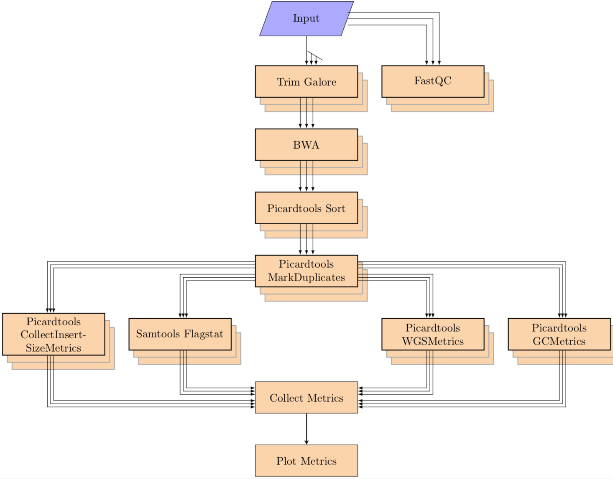

The single cell analysis pipeline runs on a list of pairs of fastq file (paired end) and performs the following steps:

Alignment:

1. Run fastqc on the fastq files
2. Align the fastq pairs with bwa (supports both mem and aln)
3. Merge all lanes together
4. create targets and realign around those targets with GATK
5. sort bams files, mark duplicate reads and index final bams
6. collect metrics from samtools flagstat, picardtools CollectInsertSizeMetrics, picardtools CollectWgsMetrics and picardtools CollectGcBiasMetrics
7. generate QC plot

### Input

The pipeline accepts a yaml file as input. The yaml file contains the input paths and metadata for each cell, the format for each cell is as follows:
```
SA12345-A12345-R01-C01:
  column: 01 # column number of the well on chip
  condition: A # condition during experiment. will be renamed to experimental_condition in output
  fastqs:
    LANE_ID_1:
      fastq_1: /path/to/fastqfile/ACTACT-AGTAGT_1.fastq.gz
      fastq_2: /path/to/fastqfile/ACTACT-AGTAGT_1.fastq.gz
      sequencing_center: CENTERID # sequencing center id
      sequencing_instrument: INSTRUMENT_TYPE # sequencing machine (HiseqX for hiseq, N550 for nextseq machine). pipeline will not run trim galore on N550 output.
    LANE_ID_2:
      fastq_1: /path/to/fastqfile/ATTATT-ACTACT_1.fastq.gz
      fastq_2: /path/to/fastqfile/ATTATT-ACTACT_1.fastq.gz
      sequencing_center: CENTERID
      sequencing_instrument: INSTRUMENT_TYPE
  img_col: 10 # column number of the well on chip image
  index_i5: i5-INDEX
  index_i7: i7-INDEX
  pick_met: CELLCALL # describes whether cell is dividing, dead etc. will be renamed in output to cell_call
  primer_i5: ACTACTATT
  primer_i7: AGTAGTACT
  row: 01 # row number of the well on chip
  sample_type: C # sample type (flagged by wet lab team)
```

### Run:

```
single_cell alignment \
 --input_yaml inputs/SC-1234/fastqs.yaml \
 --tmpdir temp/SC-1234/tmp \
 --pipelinedir pipeline/SC-1234  \
 --out_dir results/SC-1234/results/alignment \
 --bams_dir results/SC-1234/results/bams \
 --library_id A123123 \
 ...
```

### Outputs

The aligment pipeline produces two sets of results, Bams and Alignment stats.

#### BAMs

Bam files are named as `{CELL_ID}.bam` in the BAM results directory.

The metadata file is structured as follows:

```
filenames:
  - {CELL_ID_1}.bam
  - {CELL_ID_1}.bam.bai
  - {CELL_ID_2}.bam
  - {CELL_ID_2}.bam.bai
  ...
meta:
  type: cellbams
  version: v0.0.0
  library_id: LIBRARY_ID
  cell_ids:
    - CELL_ID_1
    - CELL_ID_1
  lane_ids:
    - LANE_ID_1
    - LANE_ID_2
  bams:
    template: {cell_id}.bam
    instances:
      - cell_id: CELL_ID_1
      - cell_id: CELL_ID_2
```

#### Alignment Stats

The aligment pipeline produces a set of csv format tables and pdfs:

  - alignment metrics: `{LIBRARY_ID}_alignment_metrics.csv.gz`
  - gc metrics: `{LIBRARY_ID}_gc_metrics.csv.gz`
  - fastqscreen metrics: `{LIBRARY_ID}_detailed_fastqscreen_metrics.csv.gz`
  - alignment metrics plots: `{LIBRARY_ID}_alignment_metrics.pdf`
  - alignment metrics tar: `{LIBRARY_ID}_alignment_metrics.tar.gz`

The metadata file is structured as follows:

```
filenames:
  - {LIBRARY_ID}_{TABLE_1}.csv.gz
  - {LIBRARY_ID}_{TABLE_1}.csv.gz.yaml
  - input.yaml
  ...

meta:
  cell_ids:
    - CELL_ID_1
    - CELL_ID_2
  command: 'single_cell alignment ...'
  input_yaml: input.yaml
  type: alignment
  version: v0.0.0
  library_id: LIBRARY_ID
  lane_ids:
    - LANE_ID_1
    - LANE_ID_2
```

The alignment pipeline classifies the species for each read. You can read more about it in detail here: [Organism Filter](organism_filter.md)

You can also read more about the alignment metrics data [here](alignment_metrics.md) and gc metrics [here](gc_metrics.md)

## 2. HMMcopy

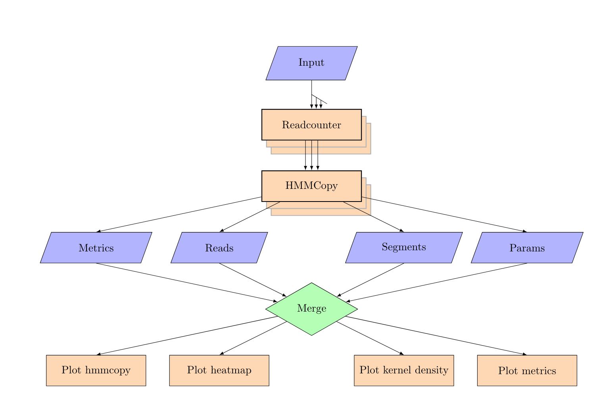

Hmmcopy:

1. generate read count wig files from the bam files
2. perform  GC correction
3. Run Hmmcopy to predict copynumber states
4. generate segment and bias plots, kernel density plot and heatmaps

### Input

The pipeline accepts a yaml file as input. The yaml file contains the input paths and metadata for each cell, the format for each cell is as follows:

```
SA12345-A12345-R01-C01:
  bam: /path/to/aligned/SA12345-A12345-R01-C01.bam # path to the bam file, align mode will write a bam file to this path
  column: 01 # column number of the well on chip
  condition: A # condition during experiment. will be renamed to experimental_condition in output
  img_col: 10 # column number of the well on chip image
  index_i5: i5-INDEX
  index_i7: i7-INDEX
  pick_met: CELLCALL # describes whether cell is dividing, dead etc. will be renamed in output to cell_call
  primer_i5: ACTACTATT
  primer_i7: AGTAGTACT
  row: 01 # row number of the well on chip
  sample_type: C # sample type (flagged by wet lab team)
```

### Run:

```
single_cell hmmcopy \
 --input_yaml inputs/SC-1234/bams.yaml \
 --tmpdir temp/SC-1234/tmp \
 --pipelinedir pipeline/SC-1234  \
 --out_dir results/SC-1234/results/hmmcopy \
 --library_id A123123 \
 ...
```

### Outputs

The hmmcopy pipeline produces HMMCopy results.

#### HMMCopy results

The output of hmmcopy is a set of tables and plots:

  - reads table: `{LIBRARY_ID}_reads.csv.gz`
  - segs table: `{LIBRARY_ID}_segments.csv.gz`
  - params table: `{LIBRARY_ID}_params.csv.gz`
  - metrics table: `{LIBRARY_ID}_hmmcopy_metrics.csv.gz`
  - hmmcopy data tar: `{LIBRARY_ID}_hmmcopy_data.tar.gz`
  - igv table: `{LIBRARY_ID}_igv_segments.seg`
  - segs plots: `{LIBRARY_ID}_segs.tar.gz`
  - bias plots: `{LIBRARY_ID}_bias.tar.gz`
  - heatmap plots: `{LIBRARY_ID}_heatmap_by_ec.pdf`
  - metrics plots: `{LIBRARY_ID}_hmmcopy_metrics.pdf`
  - kernel density plots: `{LIBRARY_ID}_kernel_density.pdf`

The metadata file is structured as follows:

```
filenames:
  - {LIBRARY_ID}_{TABLE_1}.csv.gz
  - {LIBRARY_ID}_{TABLE_1}.csv.gz.yaml
  ...
meta:
  command: 'single_cell hmmcopy ...'
  input_yaml: input.yaml
  type: hmmcopy
  version: v0.0.0
  library_id: LIBRARY_ID
  cell_ids:
    - CELL_ID_1
    - CELL_ID_1
```

You can read more about the data in the reads table [here](hmmcopy_reads.md), segments table [here](hmmcopy_segments.md) and metrics table here [here](hmmcopy_metrics.md).

## 3. Annotation

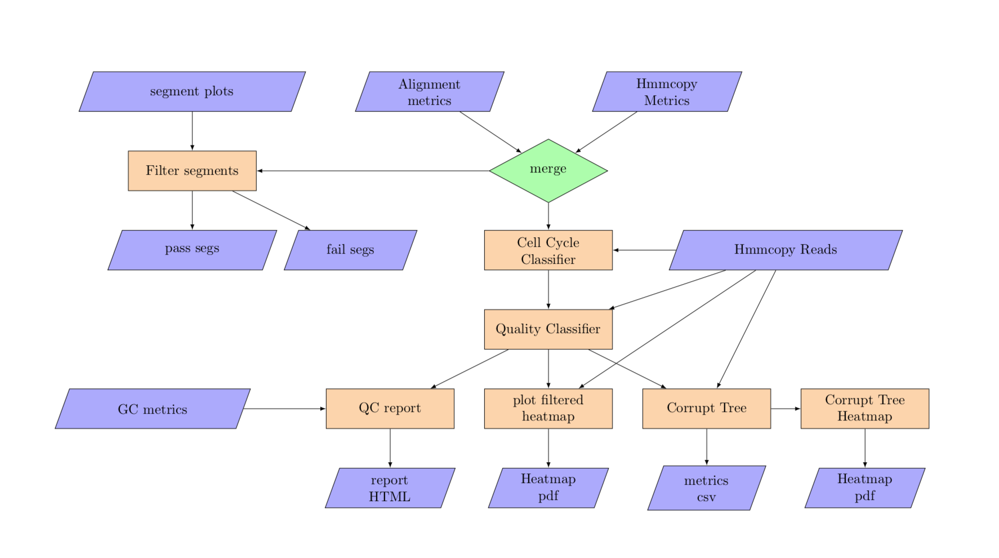

Annotation:
1. Assign a quality score to each cell
2. Assign cell state to each cell
3. Generate a consolidated table with all metrics frim hmmcopy, alignment and from annotation

### Input

The pipeline accepts a yaml file as input. The yaml file contains the input paths and metadata for each cell, the format for each cell is as follows:

```
hmmcopy_metrics: results/hmmcopy/A12345A_hmmcopy_metrics.csv.gz
hmmcopy_reads: results/hmmcopy/A12345_reads.csv.gz
alignment_metrics: results/alignment/A12345_alignment_metrics.csv.gz
gc_metrics: results/alignment/A12345_gc_metrics.csv.gz
segs_pdf_tar: results/hmmcopy/A12345_segs.tar.gz```
```

### Run

```
single_cell annotation \
 --input_yaml inputs/SC-1234/annotation.yaml \
 --tmpdir temp/SC-1234/tmp \
 --pipelinedir pipeline/SC-1234  \
 --out_dir results/SC-1234/results/annotation \
 --library_id A123123 \
 ...
```

### Outputs

The annotation pipeline produces a set of annotation results.

#### Annotation results

The output of annotation is a set of tables and plots:

  - metrics table: `{LIBRARY_ID}_metrics.csv.gz`
  - qc report: `{LIBRARY_ID}_QC_report.html`
  - corrupt tree newick: `{LIBRARY_ID}_corrupt_tree.newick`
  - consensus tree newick: `{LIBRARY_ID}_corrupt_tree_consensus.newick`
  - phylo table: `{LIBRARY_ID}_phylo.csv`
  - loci rank trees: `{LIBRARY_ID}_rank_loci_trees.csv`
  - filtered data table: `{LIBRARY_ID}_filtered_data.csv`
  - corrupt tree plot: `{LIBRARY_ID}_corrupt_tree.pdf`
  - segs pass plots: `{LIBRARY_ID}_segs_pass.tar.gz`
  - segs fail plots: `{LIBRARY_ID}_segs_fail.tar.gz`
  - corrupt heatmat plot: `{LIBRARY_ID}_heatmap_corrupt_tree.pdf`
  - heatmap filt plot: `{LIBRARY_ID}_heatmap_by_ec_filtered.pdf`

The metadata file is structured as follows:

```
filenames:
  - {LIBRARY_ID}_{TABLE_1}.csv.gz
  - {LIBRARY_ID}_{TABLE_1}.csv.gz.yaml
  ...
meta:
  command: 'single_cell annotation ...'
  input_yaml: input.yaml
  type: annotation
  version: v0.0.0
  library_id: LIBRARY_ID
```


The annotation pipeline runs the:
1. Cell Cycle Classifier: You can learn more here: [cell_cycle_classifier](https://github.com/shahcompbio/cell_cycle_classifier)
2. Cell Quality Classifier: You can learn more here: [cell quality classifier](quality_classifier.md)


The metrics table is described in detail [here](annotation_metrics.md)

## 4. Split merge cell bams

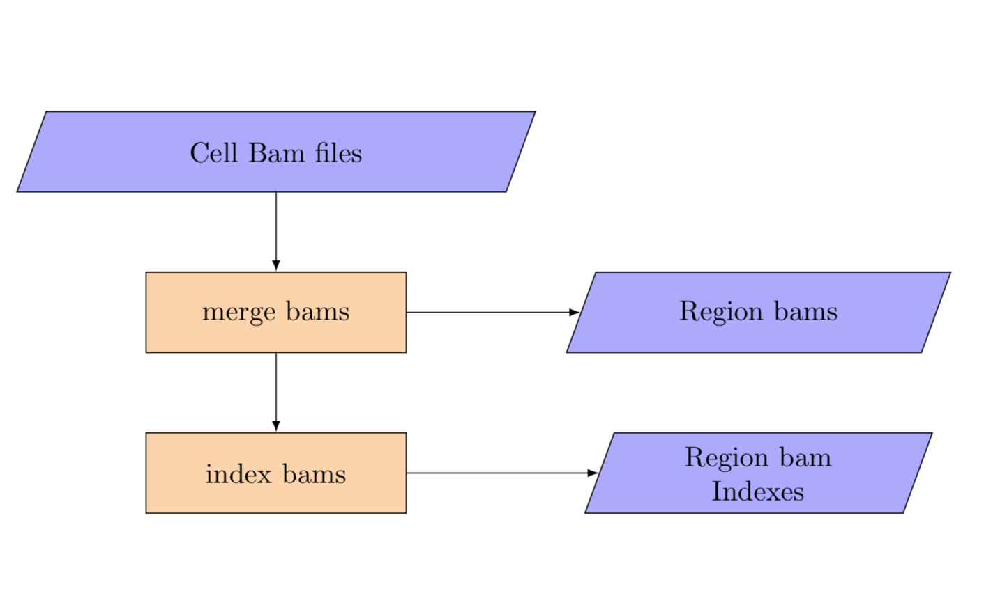

The tumour needs to be simultaneously merged across cells and split by region. The input for this step is the per cell bam yaml and the template for the merged bams by region.

### Input:

```
cell_bams:
  SA123X5-A12345-R04-C03:
    bam: data/single_cell_indexing/bam/A12345/grch37/bwa-aln/SA123X5-A12345-R04-C03.bam
  SA123X5-A12345-R04-C05:
    bam: data/single_cell_indexing/bam/A12345/grch37/bwa-aln/SA123X5-A12345-R04-C05.bam
  SA123X5-A12345-R04-C07:
    bam: data/single_cell_indexing/bam/A12345/grch37/bwa-aln/SA123X5-A12345-R04-C07.bam
  SA123X5-A12345-R04-C09:
    bam: data/single_cell_indexing/bam/A12345/grch37/bwa-aln/SA123X5-A12345-R04-C09.bam
  SA123X5-A12345-R04-C10:
    bam: data/single_cell_indexing/bam/A12345/grch37/bwa-aln/SA123X5-A12345-R04-C10.bam
```

### Run:

```
single_cell merge_cell_bams \
 --input_yaml inputs/SC-1234/merge_cell_bams.yaml \
 --tmpdir temp/SC-1234/tmp \
 --pipelinedir pipeline/SC-1234  \
 --out_dir results/SC-1234/results \
 ...
```

### Outputs

The split merge pipeline produces a set of bams split by region.

#### Region BAMs

Bam files are named as `{REGION_1}.bam` in the BAM results directory.

The metadata file is structured as follows:

```
filenames:
  - {REGION_1}.bam
  - {REGION_2}.bam
  ...
meta:
  command: 'single_cell merge_cell_bams ...'
  input_yaml: input.yaml
  type: pseudowgs_regionbams
  version: v0.0.0
  cell_ids:
    - CELL_ID_1
    - CELL_ID_1
  bams:
    template: {region}.bam
    instances:
      - region: REGION_1
      - region: REGION_2
```

## 5. Split bams

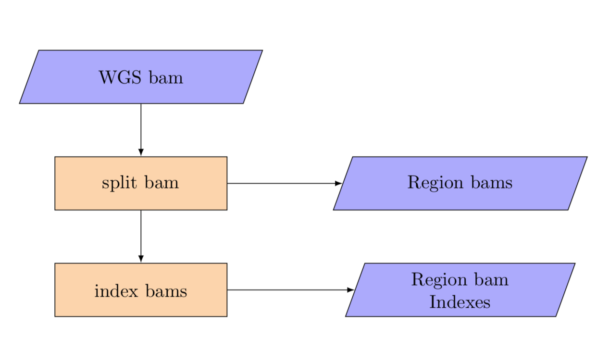

The normal also needs to be split by region from an input data path to an output per region template.

### Input:
```
normal:
  bam: scdnadev/testdata/pseudobulk/DAH370N_filtered.bam
```

### Run:

```
single_cell split_wgs_bam \
 --input_yaml inputs/SC-1234/merge_cell_bams.yaml \
 --tmpdir temp/SC-1234/tmp \
 --pipelinedir pipeline/SC-1234  \
 --out_dir results/SC-1234/results \
...
```

### Outputs

The split pipeline produces a set of bams split by region.

#### Region BAMs

Bam files are named as `{REGION_1}.bam` in the BAM results directory.

The metadata file is structured as follows:


```
filenames:
  - {REGION_1}.bam
  - {REGION_2}.bam
  ...
meta:
  command: 'single_cell split_wgs_bam ...'
  input_yaml: input.yaml
  type: wgs_regionbams
  version: v0.0.0
  bams:
    template: {region}.bam
    instances:
      - region: REGION_1
      - region: REGION_2
```

## 6. Variant Calling

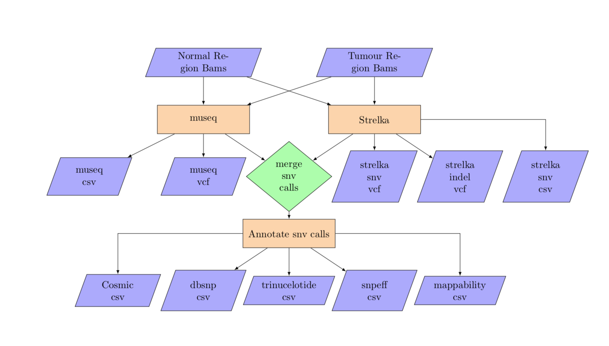

Inputs are a WGS tumour bam file and a WGS normal bam file along with the tumour cells. The bam files are used for the variant calling. The pipeline also generates counts at the snvs for each cell.
The variant calling takes in both the per cell bam yaml, using the per cell bams for variant allele counting, and the tumour and normal region templates for calling snvs in parallel by region.


### Input:
```
normal:
  1-1-10000000:
    bam: split_wgs_bam/1-1-10000000_split_wgs.bam
  1-100000001-110000000:
    bam: split_wgs_bam/1-100000001-110000000_split_wgs.bam
  1-10000001-20000000:
    bam: split_wgs_bam/1-10000001-20000000_split_wgs.bam
  ...
tumour:
  1-1-10000000:
    bam: merge_cell_bams/1-1-10000000_split_wgs.bam
  1-100000001-110000000:
    bam: merge_cell_bams/1-100000001-110000000_split_wgs.bam
  1-10000001-20000000:
    bam: merge_cell_bams/1-10000001-20000000_split_wgs.bam
  ...
```

### Run:

```
single_cell variant_calling \
 --input_yaml inputs/SC-1234/variant_calling.yaml \
 --tmpdir temp/SC-1234/tmp \
 --pipelinedir pipeline/SC-1234  \
 --out_dir results/SC-1234/results \
...
```

### Outputs

The metadata file is structured as follows:

```
filenames:
  - {LIBRARY_ID}_{TABLE_1}.csv.gz
  - {LIBRARY_ID}_{TABLE_1}.csv.gz.yaml
  ...
meta:
  command: 'single_cell variant_calling ...'
  input_yaml: input.yaml
  type: variant_calling
  version: v0.0.0
```


## 7. Breakpoint calling

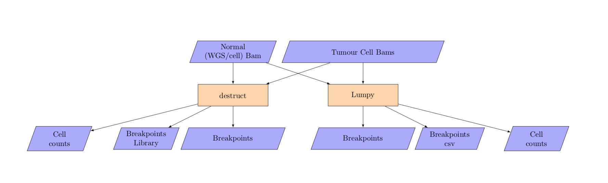

The breakpoint analysis takes in per cell bam yaml in addition to the unsplit matched normal bam filename.

### Input:

#### yaml file format with a single normal bam
```
normal_wgs:
    bam: singlecelldatatest/testdata/pseudobulk/SA123N.bam
tumour_cells:
    SA123X5-A12345-R04-C03:
      bam: data/single_cell_indexing/bam/A12345/grch37/bwa-aln/SA123X5-A12345-R04-C03.bam
    SA123X5-A12345-R04-C05:
      bam: data/single_cell_indexing/bam/A12345/grch37/bwa-aln/SA123X5-A12345-R04-C05.bam
    SA123X5-A12345-R04-C07:
      bam: data/single_cell_indexing/bam/A12345/grch37/bwa-aln/SA123X5-A12345-R04-C07.bam
    SA123X5-A12345-R04-C09:
      bam: data/single_cell_indexing/bam/A12345/grch37/bwa-aln/SA123X5-A12345-R04-C09.bam
    SA123X5-A12345-R04-C10:
      bam: data/single_cell_indexing/bam/A12345/grch37/bwa-aln/SA123X5-A12345-R04-C10.bam
```

#### yaml file format with a cells for normal

```
normal_cells:
    SA123N-A12345-R04-C03:
      bam: data/single_cell_indexing/bam/A12345/grch37/bwa-aln/SA123X5-A12345-R04-C03.bam
    SA123N-A12345-R04-C05:
      bam: data/single_cell_indexing/bam/A12345/grch37/bwa-aln/SA123X5-A12345-R04-C05.bam
    SA123N-A12345-R04-C07:
      bam: data/single_cell_indexing/bam/A12345/grch37/bwa-aln/SA123X5-A12345-R04-C07.bam
    SA123N-A12345-R04-C09:
      bam: data/single_cell_indexing/bam/A12345/grch37/bwa-aln/SA123X5-A12345-R04-C09.bam
    SA123N-A12345-R04-C10:
      bam: data/single_cell_indexing/bam/A12345/grch37/bwa-aln/SA123X5-A12345-R04-C10.bam
tumour_cells:
    SA123X5-A12345-R04-C03:
      bam: data/single_cell_indexing/bam/A12345/grch37/bwa-aln/SA123X5-A12345-R04-C03.bam
    SA123X5-A12345-R04-C05:
      bam: data/single_cell_indexing/bam/A12345/grch37/bwa-aln/SA123X5-A12345-R04-C05.bam
    SA123X5-A12345-R04-C07:
      bam: data/single_cell_indexing/bam/A12345/grch37/bwa-aln/SA123X5-A12345-R04-C07.bam
    SA123X5-A12345-R04-C09:
      bam: data/single_cell_indexing/bam/A12345/grch37/bwa-aln/SA123X5-A12345-R04-C09.bam
    SA123X5-A12345-R04-C10:
      bam: data/single_cell_indexing/bam/A12345/grch37/bwa-aln/SA123X5-A12345-R04-C10.bam
```

### Run:

```
single_cell breakpoint_calling \
 --input_yaml inputs/SC-1234/breakpoint_calling.yaml \
 --tmpdir temp/SC-1234/tmp \
 --pipelinedir pipeline/SC-1234  \
 --out_dir results/SC-1234/results \
...
```

NOTE: The input bam files for lumpy must be aligned with bwa mem.

### Outputs

The metadata file is structured as follows:

```
filenames:
  - {LIBRARY_ID}_{TABLE_1}.csv.gz
  - {LIBRARY_ID}_{TABLE_1}.csv.gz.yaml
  ...
meta:
  command: 'single_cell breakpoint_calling ...'
  input_yaml: input.yaml
  type: breakpoint_calling
  version: v0.0.0
```


## 8. Haplotype calling:

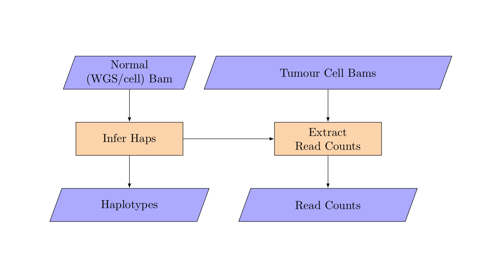

The haplotype analysis takes in per cell bam yaml in addition to the unsplit matched normal bam filename.

### Input:

#### yaml file format with a single normal bam
```
normal_wgs:
    bam: singlecelldatatest/testdata/pseudobulk/SA123N.bam
tumour_cells:
    SA123X5-A12345-R04-C03:
      bam: data/single_cell_indexing/bam/A12345/grch37/bwa-aln/SA123X5-A12345-R04-C03.bam
    SA123X5-A12345-R04-C05:
      bam: data/single_cell_indexing/bam/A12345/grch37/bwa-aln/SA123X5-A12345-R04-C05.bam
    SA123X5-A12345-R04-C07:
      bam: data/single_cell_indexing/bam/A12345/grch37/bwa-aln/SA123X5-A12345-R04-C07.bam
    SA123X5-A12345-R04-C09:
      bam: data/single_cell_indexing/bam/A12345/grch37/bwa-aln/SA123X5-A12345-R04-C09.bam
    SA123X5-A12345-R04-C10:
      bam: data/single_cell_indexing/bam/A12345/grch37/bwa-aln/SA123X5-A12345-R04-C10.bam
```

#### yaml file format with a cells for normal
```
normal_cells:
    SA123N-A12345-R04-C03:
      bam: data/single_cell_indexing/bam/A12345/grch37/bwa-aln/SA123X5-A12345-R04-C03.bam
    SA123N-A12345-R04-C05:
      bam: data/single_cell_indexing/bam/A12345/grch37/bwa-aln/SA123X5-A12345-R04-C05.bam
    SA123N-A12345-R04-C07:
      bam: data/single_cell_indexing/bam/A12345/grch37/bwa-aln/SA123X5-A12345-R04-C07.bam
    SA123N-A12345-R04-C09:
      bam: data/single_cell_indexing/bam/A12345/grch37/bwa-aln/SA123X5-A12345-R04-C09.bam
    SA123N-A12345-R04-C10:
      bam: data/single_cell_indexing/bam/A12345/grch37/bwa-aln/SA123X5-A12345-R04-C10.bam
tumour_cells:
    SA123X5-A12345-R04-C03:
      bam: data/single_cell_indexing/bam/A12345/grch37/bwa-aln/SA123X5-A12345-R04-C03.bam
    SA123X5-A12345-R04-C05:
      bam: data/single_cell_indexing/bam/A12345/grch37/bwa-aln/SA123X5-A12345-R04-C05.bam
    SA123X5-A12345-R04-C07:
      bam: data/single_cell_indexing/bam/A12345/grch37/bwa-aln/SA123X5-A12345-R04-C07.bam
    SA123X5-A12345-R04-C09:
      bam: data/single_cell_indexing/bam/A12345/grch37/bwa-aln/SA123X5-A12345-R04-C09.bam
    SA123X5-A12345-R04-C10:
      bam: data/single_cell_indexing/bam/A12345/grch37/bwa-aln/SA123X5-A12345-R04-C10.bam
```

### Run:

```
single_cell haplotype_calling \
 --input_yaml inputs/SC-1234/haplotype_calling.yaml \
 --tmpdir temp/SC-1234/tmp \
 --pipelinedir pipeline/SC-1234  \
 --out_dir results/SC-1234/results \
...
```


### Outputs

The metadata file is structured as follows:

```
filenames:
  - {LIBRARY_ID}_{TABLE_1}.csv.gz
  - {LIBRARY_ID}_{TABLE_1}.csv.gz.yaml
  ...
meta:
  command: 'single_cell infer_haps ...'
  input_yaml: input.yaml
  type: infer_haps
  version: v0.0.0
```


## 9. SNV genotyping:

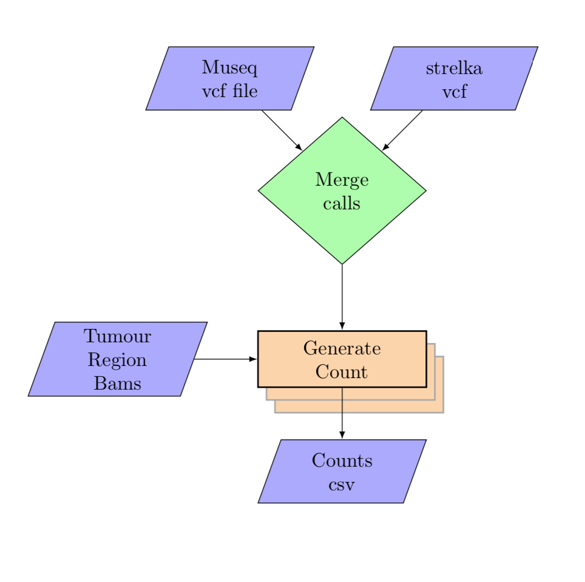

### Input:

```
vcf_files:
  SA123N:
    A1234:
      museq_vcf: vcfs/museq.vcf
      strelka_snv_vcf: vcfs/strelka.vcf
tumour_cells:
  SA123N:
    SA123N-A12345-R04-C03:
      bam: data/single_cell_indexing/bam/A12345/grch37/bwa-aln/SA123X5-A12345-R04-C03.bam
    SA123N-A12345-R04-C05:
      bam: data/single_cell_indexing/bam/A12345/grch37/bwa-aln/SA123X5-A12345-R04-C05.bam
    SA123N-A12345-R04-C07:
      bam: data/single_cell_indexing/bam/A12345/grch37/bwa-aln/SA123X5-A12345-R04-C07.bam
    SA123N-A12345-R04-C09:
      bam: data/single_cell_indexing/bam/A12345/grch37/bwa-aln/SA123X5-A12345-R04-C09.bam
    SA123N-A12345-R04-C10:
      bam: data/single_cell_indexing/bam/A12345/grch37/bwa-aln/SA123X5-A12345-R04-C10.bam
```

### Run:

```
single_cell snv_genotyping \
 --input_yaml inputs/SC-1234/snv_genotyping.yaml \
 --tmpdir temp/SC-1234/tmp \
 --pipelinedir pipeline/SC-1234  \
 --out_dir results/SC-1234/results \
...
```

### Outputs

The metadata file is structured as follows:

```
filenames:
  - {LIBRARY_ID}_{TABLE_1}.csv.gz
  - {LIBRARY_ID}_{TABLE_1}.csv.gz.yaml
  ...
meta:
  command: 'single_cell snv_genotyping ...'
  input_yaml: input.yaml
  type: snv_genotyping
  version: v0.0.0
```


## 10. Germline Calling:
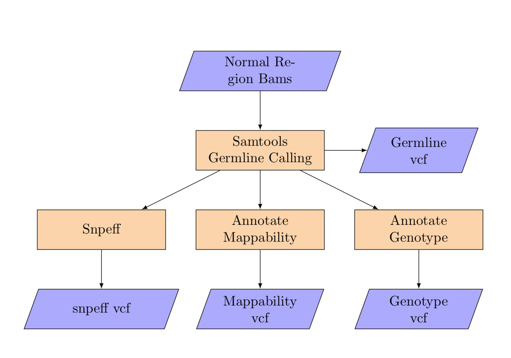


### Input:

```
normal:
  1-1-10000000:
    bam: split_wgs_bam/1-1-10000000_split_wgs.bam
  1-100000001-110000000:
    bam: split_wgs_bam/1-100000001-110000000_split_wgs.bam
  1-10000001-20000000:
    bam: split_wgs_bam/1-10000001-20000000_split_wgs.bam
  ...
```

### Run:

```
single_cell germline \
 --input_yaml inputs/SC-1234/variant_counting.yaml \
 --tmpdir temp/SC-1234/tmp \
 --pipelinedir pipeline/SC-1234  \
 --out_dir results/SC-1234/results \
...
```

### Outputs

The metadata file is structured as follows:

```
filenames:
  - {LIBRARY_ID}_{TABLE_1}.csv.gz
  - {LIBRARY_ID}_{TABLE_1}.csv.gz.yaml
  ...
meta:
  command: 'single_cell germline_calling ...'
  input_yaml: input.yaml
  type: germline_calling
  version: v0.0.0
```

## 11. Pseudobulk QC:
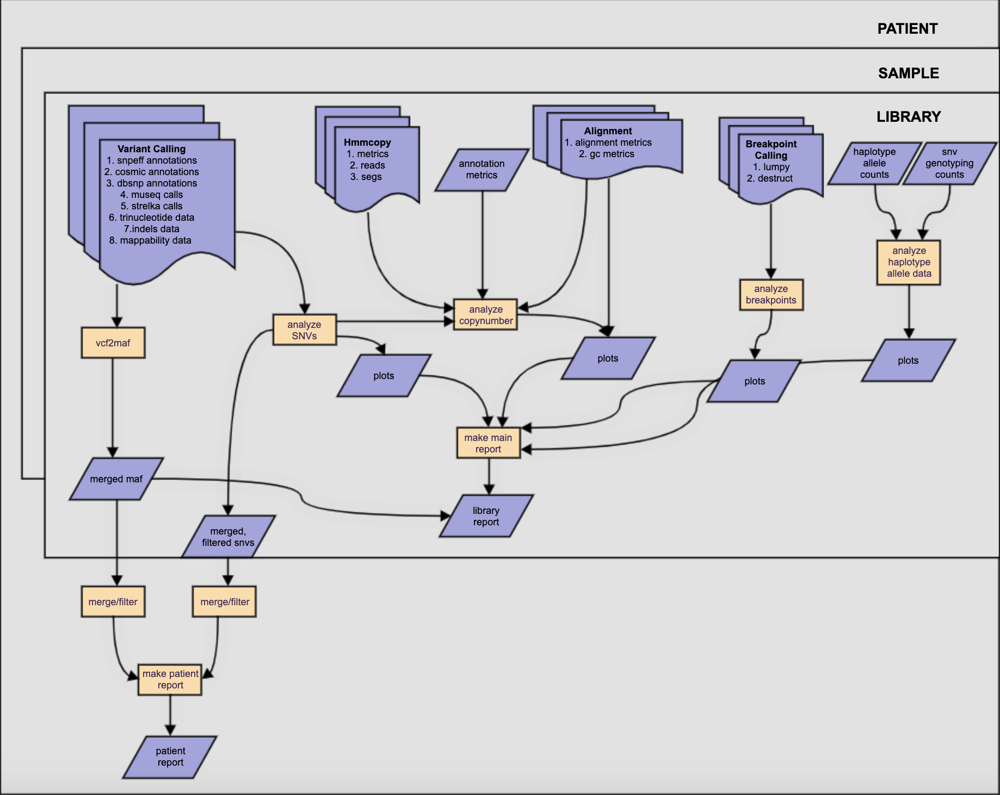

### Input:

```
SA123:
  SA123X1:
    A123:
      mappability: PSEUDO_BULK_QC/ref_test_data/snv_mappability.csv.gz
      strelka: PSEUDO_BULK_QC/ref_test_data/snv_strelka.csv.gz
      museq: PSEUDO_BULK_QC/ref_test_data/snv_museq.csv.gz
      cosmic_status: PSEUDO_BULK_QC/ref_test_data/snv_cosmic_status.csv.gz
      snpeff: PSEUDO_BULK_QC/ref_test_data/snv_snpeff.csv.gz
      dbsnp_status: PSEUDO_BULK_QC/ref_test_data/snv_dbsnp_status.csv.gz
      trinuc: PSEUDO_BULK_QC/ref_test_data/snv_trinuc.csv.gz
      counts: PSEUDO_BULK_QC/ref_test_data/snv_genotyping_counts.csv.gz
      destruct_breakpoint_annotation: PSEUDO_BULK_QC/ref_test_data/destruct_breakpoints.csv.gz
      destruct_breakpoint_counts: PSEUDO_BULK_QC/ref_test_data/destruct_cell_counts.csv.gz
      lumpy_breakpoint_annotation: PSEUDO_BULK_QC/ref_test_data/lumpy_breakpoints.csv.gz
      lumpy_breakpoint_evidence: PSEUDO_BULK_QC/ref_test_data/lumpy_breakpoints_evidence.csv.gz
      haplotype_allele_data: PSEUDO_BULK_QC/ref_test_data/allele_counts.csv.gz
      annotation_metrics: PSEUDO_BULK_QC/ref_test_data/annotation_metrics.csv.gz
      hmmcopy_reads: PSEUDO_BULK_QC/ref_test_data/hmmcopy_reads.csv.gz
      hmmcopy_segs: PSEUDO_BULK_QC/ref_test_data/hmmcopy_segments.csv.gz
      hmmcopy_metrics: PSEUDO_BULK_QC/ref_test_data/hmmcopy_metrics.csv.gz
      alignment_metrics: PSEUDO_BULK_QC/ref_test_data/alignment_metrics.csv.gz
      gc_metrics: PSEUDO_BULK_QC/ref_test_data/gc_metrics.csv.gz
      indel_file: PSEUDO_BULK_QC/ref_test_data/strelka_indel.vcf.gz
      isabl_id: {isabl-specific id for SA123X1}
```

### Run:

```
single_cell pseudo_bulk_qc \
 --input_yaml inputs/SC-1234/variant_counting.yaml \
 --tmpdir temp/SC-1234/tmp \
 --pipelinedir pipeline/SC-1234  \
 --out_dir results/SC-1234/results \
...
```

### Outputs

The metadata file is structured as follows:

```
filenames:
./{patient_id}/mutationreport.html
./{patient_id}/grouplevel_high_impact_maf.maf
./{patient_id}/grouplevel_high_impact_merged_snvs.csv
./{patient_id}/grouplevelmaf.maf
./{patient_id}/grouplevel_snvs.csv
./{patient_id}/{sample_id}/{library_id}/mainreport.html
./{patient_id}/{sample_id}/{library_id}/{library_id}_snvs_high_impact.csv
./{patient_id}/{sample_id}/{library_id}/{library_id}_num_cells_class_top10_mutsig.pdf
./{patient_id}/{sample_id}/{library_id}/{library_id}_num_cells_class_mutsig.pdf
./{patient_id}/{sample_id}/{library_id}/{library_id}/snvs_high_impact.csv
./{patient_id}/{sample_id}/{library_id}/{library_id}/samplelevelmaf.maf
./{patient_id}/{sample_id}/{library_id}/{library_id}/snv_alt_counts.pdf
./{patient_id}/{sample_id}/{library_id}/{library_id}/snvs_all.csv
./{patient_id}/{sample_id}/{library_id}/{library_id}/summary.csv
./{patient_id}/{sample_id}/{library_id}/{library_id}/datatype_summary.csv
./{patient_id}/{sample_id}/{library_id}/{library_id}/snv_cell_counts.pdf
./{patient_id}/{sample_id}/{library_id}/trinuc.csv
./{patient_id}/{sample_id}/{library_id}/{library_id}_snv_genome_count.pdf
./{patient_id}/{sample_id}/{library_id}/{library_id}_adjacent_distance_class_mutsig.pdf
./{patient_id}/{sample_id}/{library_id}/{library_id}_adjacent_distance_class_top10_mutsig.pdf
./{patient_id}/{sample_id}/{library_id}/{library_id}_snv_adjacent_distance.pdf
meta:
  command: 'single_cell pseudo_bulk_qc ...'
  input_yaml: input.yaml
  type: pseudo_bulk_qc
  version: v0.0.0
```

### Output Descriptions
| FILENAME                                           | DESCRIPTION                                                                                         |
|----------------------------------------------------|-----------------------------------------------------------------------------------------------------|
| grouplevel_high_impact_maf.maf                     | patient maf filtered on variant consequence and impact                                              |
| grouplevel_high_impact_merged_snvs.csv             | all snvs for patient filtered for high impact                                                       |
| grouplevelmaf.maf                                  | single maf with all maf data from patient                                                           |
| grouplevel_snvs.csv                                | al snvs for patient                                                                                 |
| mutationreport.html                                | html report characterizing patient-level variants                                                   |
| mainreport.html                                    | html report containing library-level analyses                                                       |
| {library}_adjacent_distance_class_top10_mutsig.pdf | bar plot of top 10 mutational signatures in the library grouped by adjacent distance                |
| {library}_adjacent_distance_class_mutsig.pdf       | heatmap of library signatures groupedby adjacent distance                                           |
| {library}_num_cells_class_top10_mutsig.pdf         | bar plot of top 10 mutational signatures grouped by number of cells                                 |
| {library}_num_cells_class_mutsig.pdf               | heatmap of mutational signatures grouped by number of cells                                         |
| {library}snvs_high_impact.csv                      | high impact snvs for the library (effect_impact=="HIGH")                                            |
| {library}Asnv_adjacent_distance.pdf                | scatterplot of distance between mutations                                                           |
| {library}snv_genome_count.pdf                      | scatterplot of distance between mutations                                                           |
| samplelevelmaf.maf                                 | barplot of number of snvs across the genome                                                         |
| snvs_all.csv                                       | all snvs for the library                                                                            |
| trinuc.csv                                         | trinucleotide contexts for the snvs in the library                                                  |
| datatype_summary.csv                               | number of cells with snvs, cnvs and haplotype variants                                              |
| snv_alt_counts.pdf                                 | histogram of alt counts/snv for the library                                                         |
| snvs_high_impact.csv                               | high impact snvs for the library (effect_umpact = {"HIGH", "NON_SYNONYMOUS_CODING", "STOP_GAINED"}) |
| snv_cell_counts.pdf                                | histogram of cell counts/snv for the library                                                        |
| summary.csv                                        | number of mutations and number of cells in the library                                              |


## 12. Pseudobulk Cohort QC:


### Input:

```
{COHORT}:
  MAFS:
    {SAMPLE}:
      germline_maf:
      somatic_maf:
  HMMCOPY:
    {SAMPLE}:
      {LIBRARY}:
        hmmcopy_reads:
```

### Run:
```
 single_cell cohort_qc --input_yaml {}  --submit {} --out_dir {} --tmpdir {} --loglevel {}  --API_key  {}
```
### Outputs


The metadata file is structured as follows:

```
filenames:
./{cohort_id}/cna_table.tsv.gz
./{cohort_id}/cohort_oncogenic_filtered.maf
./{cohort_id}/cohort_oncoplot.png
./{cohort_id}/segments.tsv.gz

```
### Output Descriptions
```
```

## 13. Generate Config

The pipeline auto generates a config file with the default parameters before every run. Some of the values in the config file can be updated by using the ``--config_override`` option.  ```generate_config``` option allows users to generate the config files. These configs can then be specified as input to the pipeline after making the required changes.
```
single_cell generate_config --pipeline_config pipeline_config.yaml --batch_config batch_config.yaml
```
the pipeline config file contains all pipeline defaults and the batch config specifies all azure batch specific settings.

the pipeline config can be specified manually when running the pipeline with ```--config_file``` option and the batch config with ```--submit_config``` option.


## 14. Clean Sentinels

the pipeline will skip any successful tasks from previous runs when run again. The ``--rerun`` flag force run all tasks including the successful tasks from the previous runs while the ```clean_sentinels``` option provides a more fine grained control.

```
single_cell clean_sentinels --mode list --pattern "*" --tmpdir temp/SC-1234/tmp/hmmcopy
```
will list all successfully completed hmmcopy tasks

```
single_cell clean_sentinels --mode delete --pattern "*" --tmpdir temp/SC-1234/tmp/hmmcopy
```
is the same as ```--rerun``` flag

running
```
single_cell clean_sentinels --mode delete --pattern "*plot_heatmap*" --tmpdir temp/SC-1234/tmp/hmmcopy
```
before launching the hmmcopy will rerun the heatmap plotting  and any tasks that haven't completed yet.

### Common options

* add ``` --storage azureblob``` to read the inputs and write the outputs to Microsoft Azure Blob Storage
* add ``` --submit local``` to run the pipeline on the current node
* add ``` --submit asyncqsub ``` to run the pipeline on a SGE cluster
* add ``` --submit azurebatch``` to run the tasks on Microsoft Azure Batch
* add ``` --nocleanup``` to disable temporary file deletion
* add ``` --loglevel DEBUG``` for verbose logging
* ```--submit_config <path to yaml config>``` for custom azure batch submission configuration file. see 10. Generate config for more details
* ```--config_file <path to yaml config>``` to specify pipeline config file.
